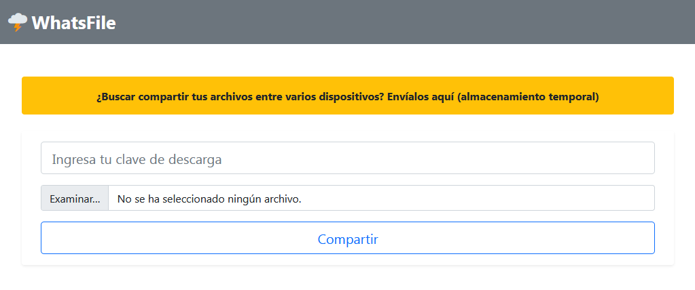
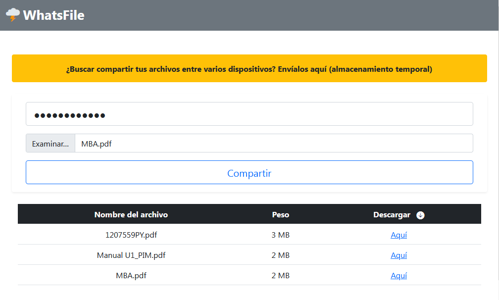

# WhatsFile :cloud_with_lightning:

Tecnologías utilizadas:

- Node JS 12 & Express Framework
- Socket IO & EJS
- Bootstrap 5

---

Esta aplicación puede:

- **Compartir archivos en tiempo real a otros dispositivos, almacenándolo temporalmente**



- **Descargar los archivos compartidos solamente con la clave asignada por el usuario**



### Instalación

```sh
git clone https://github.com/juliogarciape/whatsfile-node
cd whatsfile-node
npm install
npm run dev # run in development mode
npm start # run in production mode
```
